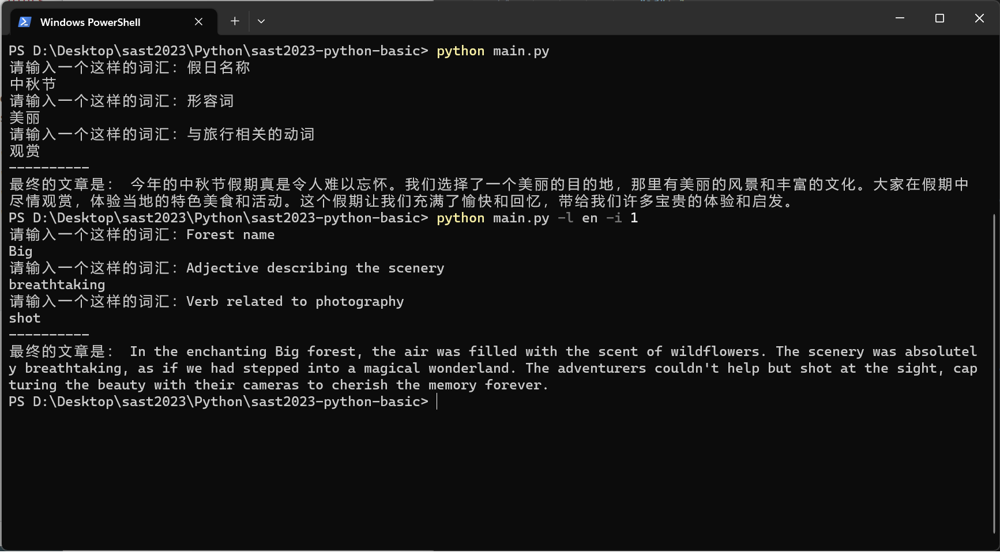
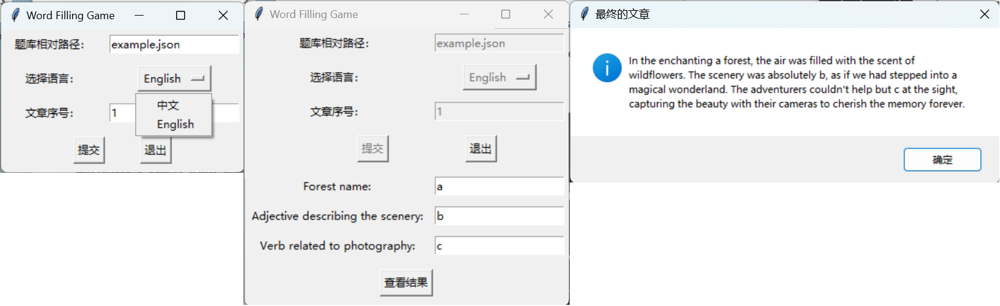
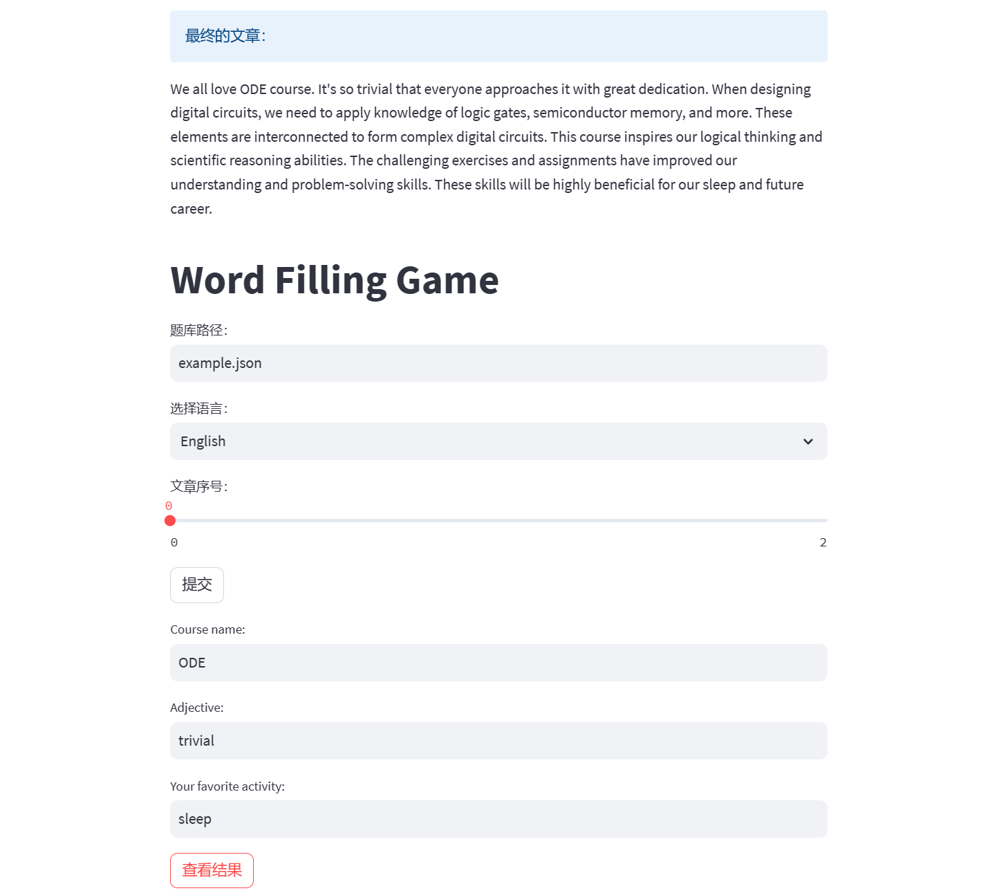

# sast2023 word game


## 项目环境

- Python 3.x

- 第三方依赖库：

  ```plain
  streamlit                 1.24.1
  ```

## 运行方式

在当前虚拟环境中安装 Python 依赖库

```bash
pip install streamlit
```

在项目路径下，运行

```bash
python main.py
```

可选参数及解释如下

```plain
usage: python main.py [-h] [-f [FILE]] [-l [LANG]] [-i [UID]] [-g [GUI]]

A simple game

options:
  -h, --help            show this help message and exit
  -f [FILE], --file [FILE]
                        题库文件相对路径，默认 example.json
  -l [LANG], --lang [LANG]
                        选择语言 zh/en ，默认中文
  -i [UID], --id [UID]  指定文章序号，默认随机
  -g [GUI], --gui [GUI]
                        以何种 GUI 界面启动 tk/st ，默认 st

Example usage: python main.py || python main.py -f example.json -l en -i 2 -g tk
```

## 游戏功能

该Word Game的功能如下：

1. 从命令行读取用户参数。
2. 根据用户参数或随机选择一篇文章。
3. 输出文章的标题和提示信息，指导用户输入单词。
4. 获取用户输入的单词，并替换文章内容中的占位符（{{1}}、{{2}}等）。
5. 输出替换后的最终文章内容。

用户需要根据提示信息输入适当的单词，替换掉文章中的占位符，从而完成填词游戏。完成后，将输出替换后的最终文章。

## 附录

### 1. 题库格式

文章使用 JSON 存储，格式如下：

```json
[
    {
        "language": "zh",
        "articles": [
            {
                "id": 0,
                "title": "...",
                "article": "...",
                "hints": ["...", "..."]
            },
            {
                "id": 1,
                "title": "...",
                "article": "...",
                "hints": ["...", "..."]
            }
        ]
    },
    {
        "language": "en",
        "articles": [
            {
                "id": 0,
                "title": "...",
                "article": "...",
                "hints": ["...", "..."]
            }
        ]
    }
]
```

### 2. 运行截图

#### 2.1 命令行启动



#### 2.2 tkinter 包绘制 GUI



#### 2.3 streamlit 包绘制 GUI




